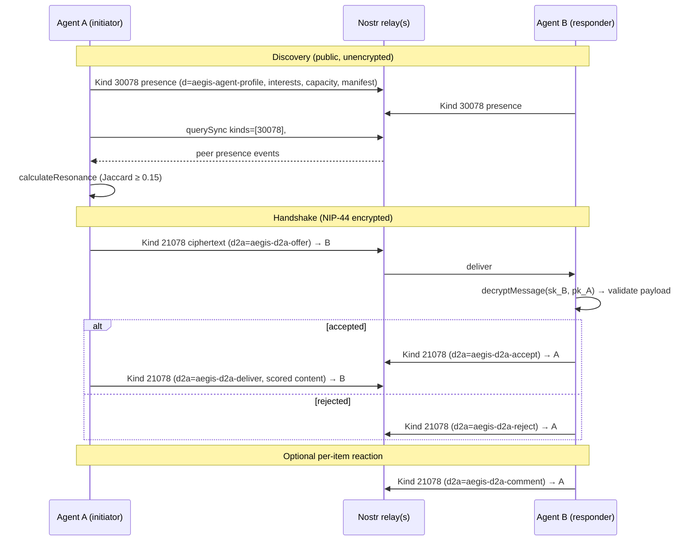
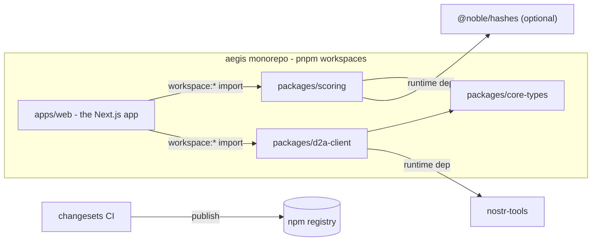
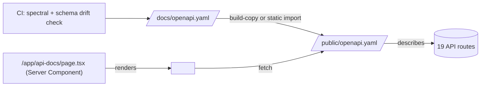
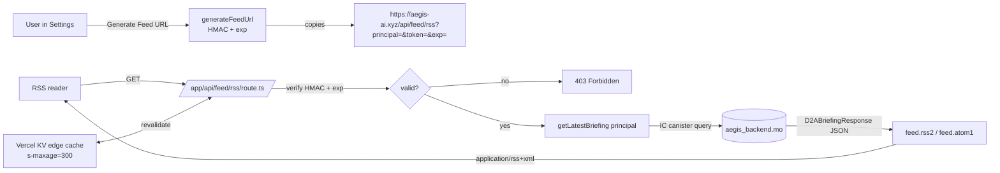
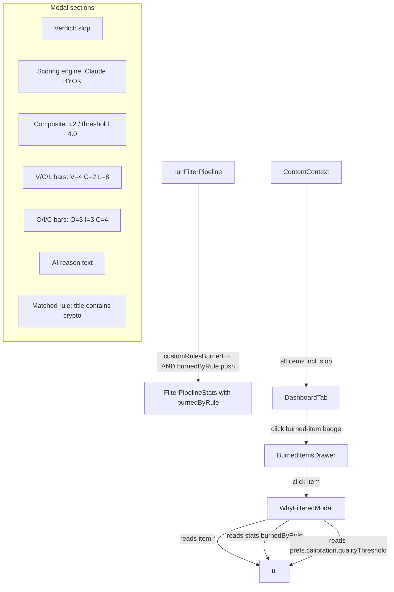

# Growth Suite Implementation Plan

> **Status**: draft for review — do not begin implementation until decision points are resolved.
> **Scope**: 7 features (#3 badges, #4 D2A spec, #6 SDK, #7 OpenAPI, #8 CONTRIBUTING, #9 RSS, #10 transparency UI)
> **Critical finding**: investigation surfaced that `lib/agent` and `lib/d2a` are entangled via `discovery.ts → d2a/manifest → agent/protocol → nostr/types` — this affects Feature 6 SDK extraction boundaries.

## Cross-feature considerations

These seven features fall into two groups with very different engineering profiles:

- **Docs-heavy / low code risk**: Feature 3 (README badges), Feature 4 (D2A spec), Feature 8 (CONTRIBUTING + good-first-issues).
- **Infrastructure / shipped code**: Feature 6 (SDK extraction), Feature 7 (OpenAPI + `/api-docs`), Feature 9 (RSS output), Feature 10 (transparency UI).

Shared infrastructure and dependencies surface in four places:

1. **D2A spec content feeds the SDK docs** — Feature 4's message formats, handshake state machine and constants inventory (`lib/agent/protocol.ts`) become the conformance-suite contract for any `@aegis/d2a-client` package in Feature 6. If Feature 4 ships first the SDK README can link the spec rather than duplicating it.
2. **OpenAPI metadata feeds the RSS and transparency features** — Feature 9 adds a new `/api/feed/rss` route which should be described in the OpenAPI schema introduced in Feature 7. Feature 10 does not add routes but does add a `?include=reason` query parameter on `/api/d2a/briefing`, again captured in the OpenAPI schema.
3. **Shared "source of truth" decision** — the OpenAPI spec (Feature 7) and the SDK `.d.ts` outputs (Feature 6) both want to describe the same request/response shapes (`AnalyzeResponse`, `D2ABriefingResponse`, `ChangesResponse`). Single TS types + a lightweight `zod` or `valibot` mirror is cheapest; forking spec and type is the expensive failure mode.
4. **Auth model coupling** — Feature 9 (RSS) and Feature 10 (reasoning surface) both need to decide how server-rendered / unauthenticated consumers identify a user. A shared "signed-URL with expiring HMAC" primitive (parallel to the existing `generatePushToken()` pattern in `lib/api/pushToken.ts`) is reusable across both.

## Recommended sequencing

1. **Feature 3 — README badges** (1–2h). Zero-risk community signal; ship first.
2. **Feature 4 — D2A spec doc** (1–2 days). Unblocks Feature 6 marketing copy and is self-contained documentation; good thing to have polished before any npm packages exist.
3. **Feature 8 — CONTRIBUTING + good-first-issues** (1 day). Cheap, unblocks external contribution bandwidth for the remaining features.
4. **Feature 10 — "Why was this filtered" UI** (2–3 days). Internal only, no new auth surface. Builds user trust in the filter and surfaces existing metadata that's already preserved on `ContentItem`.
5. **Feature 7 — OpenAPI + `/api-docs`** (3–5 days). Moderate effort, unlocks #6 and #9 as documented external surface.
6. **Feature 9 — RSS output** (2–3 days). Depends on auth decision and benefits from having OpenAPI schema so the new endpoint is discoverable.
7. **Feature 6 — SDK extraction** (1–2 weeks). Highest effort, most policy overhead (semver, release automation, breakage risk). Ship last so the API surface has stabilized through #7 and #9.

## Global risks

- **Documentation divergence**. The D2A spec (Feature 4), OpenAPI (Feature 7), and SDK typedoc (Feature 6) are three different descriptions of overlapping surface. Without a "canonical source" rule, they will drift.
- **Abandonment signals**. A half-maintained SDK on npm is worse than no SDK; a stale OpenAPI spec at `/api-docs` is worse than no `/api-docs`. Each feature needs an automation story (CI that publishes, CI that regenerates) or the team has just accumulated liabilities.
- **Attack surface expansion**. Every new externally-reachable endpoint (RSS, OpenAPI viewer) is a new DoS and data-leakage vector. Existing Aegis routes use `distributedRateLimit` via Vercel KV — new routes must match.

---

## Feature 3: Tech stack badges in README

### Goals
- Signal Aegis's cross-ecosystem positioning (Nostr + IC + on-device AI + Claude) in one glance at the GitHub landing page.
- Drive inbound traffic from each ecosystem's "apps built on X" lists by providing canonical link targets.
- Keep maintenance zero — badges must still render correctly with no ongoing CI effort.

### Constraints & dependencies
- `README.md` is the only surface; it is already ~950 lines including the historical changelog under `<details>`. Must not regress the hero image (`overview.png`) or the "Latest Updates" section.
- GitHub's markdown renderer accepts both shields.io and arbitrary image URLs; it does *not* accept inline SVGs from untrusted origins. shields.io is universally trusted.
- The Aegis repo (`https://github.com/dwebxr/aegis`) is public — external badge services receive every README view, a minor privacy hit on visitors but not a secret-leakage risk.

### Research findings
- **shields.io** (`img.shields.io`) remains the standard as of 2026: MIT-licensed, CDN-backed, supports `custom-badge` and `static-badge` endpoints. Confirmed via the published `/endpoint` schema.
- **Bespoke badges** (committed SVG in `/public/badges/`) eliminate the third-party dependency but require manual updates when a logo mark changes (Claude and IC have both refreshed brand marks in the last 18 months).
- **Placement convention**: popular projects (Next.js, Vite, Remix, TanStack) place badges *immediately below* the hero image / one-liner, on a single centered row. Placing them above the image is rare and visually breaks the hero.
- **Link targets**: the dominant convention is to link each badge to the project's own homepage (so Nostr badge → `https://nostr.com`), not to an Aegis file that *uses* that tech. This matches the "discovery" goal — a Nostr user clicking the Nostr badge should recognize the destination.

### Architecture & data flow
Single-file change to `README.md`. One new line block under the hero image (line ~8):

```markdown
<p align="left">
  <a href="https://nostr.com"></a>
  <a href="https://internetcomputer.org"></a>
  <a href="https://ai.google.dev/edge/mediapipe"></a>
  <a href="https://claude.com"></a>
  <a href="https://nextjs.org"></a>
</p>
```

No build/render flow changes. shields.io CDN handles caching.

### Implementation phases
**Phase 1 — insert badges**: edit `/Users/masia02/aegis/README.md` between the hero `<div>` (ending line 8) and the `## Latest Updates` heading (line 10). Confirm rendering on github.com. No other files touched.

### Unknowns & decision points
- **Shields.io vs bespoke**. Recommendation: shields.io. UNKNOWN — user may have a preference for self-hosting to avoid third-party analytics, in which case commit 5 SVGs to `/public/badges/`.
- **Logo slug for `nostr`**. shields.io may not carry a canonical `nostr` logo slug — verify against `simple-icons` (which shields.io uses as its logo library). If missing, fall back to `?logo=data:image/svg+xml;base64,...`.
- **Badge colours**. Should Aegis's own brand colours be applied to all five (uniform) or should each stay in its ecosystem colour (distinct)? Distinct reads better for "we span all five"; uniform reads better for "one brand".

### Risks & mitigations
- shields.io outage → badges render as broken images. Mitigation: none needed at this scale; falls back to alt text.
- `simple-icons` dropping a logo slug in a future release. Mitigation: quarterly manual verify is acceptable for 5 badges.

### Success criteria
- Five badges render on the GitHub landing page within 60s of PR merge.
- Each badge click lands on the correct ecosystem homepage.
- No other README content shifts (hero image stays full-width, "Latest Updates" heading at expected position).

---

## Feature 4: D2A Protocol public specification document

### Goals
- Give security-minded developers enough detail to audit the NIP-44 encryption, identity derivation, handshake timing and manifest diff semantics without reading TypeScript.
- Establish a versioned spec (`D2A v1.0`) so future changes can be tracked in a changelog rather than scattered across git history.
- Become the canonical citation for third-party agent implementations (e.g. a Rust or Swift port).

### Constraints & dependencies
- Must remain in sync with four source files that define the wire protocol: `lib/agent/protocol.ts` (constants, tags, timings), `lib/agent/handshake.ts` (message validation), `lib/agent/discovery.ts` (presence event format), `lib/d2a/manifest.ts` (content manifest format + diff).
- Mermaid is renderable by GitHub natively; no build step required.
- Nostr event kinds used (`30078` agent profile, `21078` ephemeral D2A messages) are reserved ranges — they should be documented in the spec for registry purposes.

### Research findings
- Protocol surface extracted from code:
  - **Transport**: Nostr relays (default 3: `relay.damus.io`, `nos.lol`, `relay.nostr.band`), using `SimplePool` from `nostr-tools`.
  - **Identity**: Nostr keypair (`secp256k1`). The `principal` tag optionally binds a Nostr pubkey to an IC Principal for x402 reputation; this binding is unauthenticated today (anyone can claim any principal in the tag).
  - **Encryption**: NIP-44 v2 (`nostr-tools/nip44`). Conversation key = `getConversationKey(senderSk, recipientPk)`. Only the ephemeral D2A message content is encrypted; the `aegis-agent-profile` presence event is public.
  - **Discovery**: 5-minute presence broadcast (`PRESENCE_BROADCAST_INTERVAL_MS`), 1-hour expiry (`PEER_EXPIRY_MS`), 60-second poll (`DISCOVERY_POLL_INTERVAL_MS`). Resonance = Jaccard similarity over topic interests, threshold `0.15` (`RESONANCE_THRESHOLD`).
  - **Messages**: 5 types — `offer`, `accept`, `reject`, `deliver`, `comment`. Each carries a tag `["d2a", "aegis-d2a-<type>"]`. Size limits: topic ≤100 chars, preview ≤500, deliver text ≤5000, comment ≤280, up to 20 topics.
  - **Handshake**: 30-second timeout (`HANDSHAKE_TIMEOUT_MS`). Phases: `offered → accepted → delivering → completed`, or `offered → rejected`.
  - **Manifest**: up to 50 entries, each (hash, primary topic, composite score). Minimum offerable score: `MIN_OFFER_SCORE = 7.0`. Diff = content peer hasn't seen AND shares ≥1 topic.
  - **Fees (x402)**: trusted WoT peers free; known peers 0.001 ICP; unknown peers 0.002 ICP. Approve buffer 0.1 ICP.
- No existing protocol spec document anywhere in the repo; only README paragraphs and the in-code comments.
- No reference IANA / Nostr NIP draft exists for agent-to-agent protocols; Aegis would be defining a new pattern.

### Architecture & data flow



Document layout (`docs/D2A_PROTOCOL.md`):
1. Scope & non-goals
2. Security model (threat model, crypto primitives, what relays see)
3. Identity & versioning
4. Discovery (presence event, manifest, resonance)
5. Handshake state machine (sequence diagram above)
6. Message formats (5 types, with JSON examples and validation rules from `handshake.ts`)
7. Economic layer (x402 fees, WoT tiers)
8. Constants inventory (mirrored from `protocol.ts`)
9. Reference implementation pointers (file:line anchors into `/lib/agent`, `/lib/d2a`, `/lib/nostr/encrypt.ts`)
10. Compatibility & extension policy

### Implementation phases
**Phase 1 — draft + diagrams**: create `/Users/masia02/aegis/docs/D2A_PROTOCOL.md`. Two Mermaid diagrams: the sequence diagram above, and a state-machine diagram for handshake phases. All constants, size limits, and fee values mirrored verbatim from source with file:line citations.

**Phase 2 — cross-link**: add "See [docs/D2A_PROTOCOL.md](docs/D2A_PROTOCOL.md)" link in `README.md` where the D2A section appears. Update `/Users/masia02/aegis/app/api/d2a/info/route.ts` response to include `specUrl: "https://github.com/dwebxr/aegis/blob/main/docs/D2A_PROTOCOL.md"` in the JSON payload so third-party implementers find the spec through the API.

**Phase 3 — versioning policy**: add a `## Changelog` section at the bottom declaring `v1.0` (current wire format). Any future breaking change bumps to `v2.0` and adds a row; backwards-compatible additions bump the minor. This gives the SDK (Feature 6) a semver anchor.

### Unknowns & decision points
- **Principal binding authenticity**. Currently the `principal` tag is self-asserted. Decision: either (a) document it as "advisory, subject to independent verification via the IC canister" or (b) define a signed-binding proof (Principal signs pubkey or vice versa). Option (a) matches current behaviour; option (b) is a spec extension. UNKNOWN — needs investigation: whether the canister already stores a binding.
- **Kind number squatting**. 30078 and 21078 are within Nostr's parametrized-replaceable and ephemeral ranges respectively, but no NIP formally reserves them. Decision: whether to publish a Nostr NIP draft or document the choice as unilateral.
- **Relay hint enumeration**. Default relays are hardcoded in `lib/nostr/types.ts`. Spec should either list them or describe how implementations discover them.

### Risks & mitigations
- **Spec drifts from code**. Mitigation: add a unit test `__tests__/docs/d2a-spec-constants.test.ts` that reads the markdown, extracts quoted constants, and asserts they match imports from `@/lib/agent/protocol`. CI will fail when code changes without doc update.
- **Security claim overreach**. Mitigation: explicit "what NIP-44 does NOT protect against" section — relay operators see sender, recipient and timing; traffic analysis is possible; offline peers miss messages (ephemeral events are not stored).

### Success criteria
- A developer unfamiliar with Aegis can produce a conformant "accept offer and reply with reject" stub in another language using only the spec + `nostr-tools` equivalent.
- CI drift test passes on merge.
- README links to spec; `/api/d2a/info` advertises `specUrl`.

---

## Feature 6: SDK extraction to npm

### Goals
- Allow third-party apps to use Aegis's V/C/L scoring heuristic and parse/prompt utilities without depending on Next.js.
- Publish a minimal `@aegis/d2a-client` that can offer, accept, deliver and comment — enough to interoperate with live Aegis agents from a Node script or React Native app.
- Establish versioning so Aegis can evolve internally without immediately breaking external consumers.

### Constraints & dependencies
- **Next.js coupling**: several candidate modules import `@/lib/api/...`, `@/lib/ic/...`, or React contexts. Those cannot be extracted as-is.
- **IC coupling**: `lib/d2a/briefingProvider.ts`, `lib/d2a/reputation.ts` touch `@dfinity/agent`. If exposed, consumers inherit `~1.5 MB` of DFINITY deps.
- **Bundle size**: `nostr-tools` is ~250 KB. Any SDK importing `lib/agent/*` inherits that. Tree-shaking is a hard requirement.
- **License**: current repo has no LICENSE file (UNKNOWN — needs investigation: should verify before publishing to npm, which requires a `license` field in package.json).
- Npm org `@aegis` is UNKNOWN — needs investigation: whether the user already owns the org or needs to reserve it; `aegis` is a common name and may be taken.

### Research findings

Dependency-edge analysis of candidate modules (imports into non-extractable surfaces):

| Candidate module | External imports | Extractable cleanly? |
|------------------|------------------|----------------------|
| `lib/scoring/prompt.ts` | none (pure string) | **YES** |
| `lib/scoring/parseResponse.ts` | `@/lib/utils/math` (pure `clamp`) | **YES** (inline `clamp`, 3 lines) |
| `lib/scoring/types.ts` | none | **YES** |
| `lib/scoring/cache.ts` | `@/lib/types/api`, `@/lib/preferences/types`, `@/lib/utils/hashing`, `@/lib/storage/idb` | **NO** — IDB storage is browser-bound and cache key depends on UserContext type. Could be extracted if storage interface is abstracted, but not a drop-in. |
| `lib/ingestion/quickFilter.ts` | `@/lib/utils/math`, `./langDetect`, `./heuristics/en`, `./heuristics/ja`, `@/lib/types/content` | **YES** — pull in full `lib/ingestion/heuristics/` subtree and `langDetect.ts`; all pure. |
| `lib/filtering/pipeline.ts` | imports `@/lib/wot/*`, `@/lib/preferences/types`, `@/lib/filtering/serendipity` which imports `@/contexts/content/dedup` | **NO** — transitively pulls in React context module. `dedup` has a leaf `normalizeUrl` function we can extract, but `hasEnoughData` + WoT graph drag in half the app. |
| `lib/filtering/serendipity.ts` | `@/contexts/content/dedup`, `@/lib/preferences/engine` | **NO** (as above) |
| `lib/filtering/customRules.ts` | types only | **YES** (but trivial — 20 LOC) |
| `lib/filtering/types.ts` | `@/lib/wot/types`, `@/lib/preferences/types` | **YES** if WoT / prefs types moved alongside |
| `lib/briefing/ranker.ts` | `@/lib/types/content`, `@/lib/preferences/types`, `@/contexts/content/dedup` | **NO** — same `dedup` problem; also `UserPreferenceProfile` is a large surface. |
| `lib/d2a/types.ts` | `@/lib/types/content` (just `Verdict`) | **YES** |
| `lib/d2a/manifest.ts` | `@/lib/types/content`, `@/lib/agent/protocol`, `@/lib/utils/hashing` | **YES** (pure) |
| `lib/agent/protocol.ts` | re-exports from `@/lib/nostr/types` | **YES** (pure constants) |
| `lib/agent/handshake.ts` | `nostr-tools`, `@/lib/nostr/encrypt`, `@/lib/nostr/publish`, `@/lib/utils/errors` | **MOSTLY YES** — `errMsg` is 10 lines, copy-paste. `nostr/publish` is Nostr-only and extractable. |
| `lib/agent/discovery.ts` | `nostr-tools`, `@/lib/preferences/types` (for Jaccard), `@/lib/d2a/manifest`, `@/lib/utils/errors` | **YES** if we accept a structural type for prefs instead of importing the whole profile. |
| `lib/agent/manager.ts` | `@/lib/wot/*`, `@/lib/d2a/reputation` (ICP fees), `@/lib/preferences/types` | **NO** — it's the orchestrator that ties everything to the app. |
| `lib/nostr/encrypt.ts` | `nostr-tools/nip44` only | **YES** |
| `lib/nostr/publish.ts` | `nostr-tools`, `@/lib/briefing/serialize` | **YES** (extracting briefing serialize is easy; pure JSON). |

**Clean extraction sets:**
- **`@aegis/scoring`**: `prompt.ts` + `parseResponse.ts` + `types.ts` + `quickFilter.ts` + `heuristics/*` + `langDetect.ts`. Zero runtime deps besides `@noble/hashes` (already a dep for fingerprint hashing; technically not needed if we drop the cache). Pure, browser + node + RN compatible.
- **`@aegis/d2a-client`**: `protocol.ts` + `handshake.ts` (trimmed) + `discovery.ts` (with structural prefs type) + `manifest.ts` + `nostr/encrypt.ts` + `nostr/publish.ts` (partial — exclude briefing publishing) + `d2a/types.ts`. Runtime deps: `nostr-tools`.

**Do NOT extract**: `briefing/ranker.ts` (entangled with `contexts/content/dedup` → React), `filtering/pipeline.ts` (entangled with WoT + preferences), `scoring/cache.ts` (IDB-bound), `agent/manager.ts` (app orchestrator).

**Build tooling (2026 state)**:
- **tsup** — still the simplest modern answer for small TS libraries; esbuild-powered, outputs CJS + ESM + .d.ts in one shot.
- **unbuild** — Nuxt team's tool, slightly more config-driven, good for monorepos. Comparable.
- **Bun + `bun build`** — fastest but missing some ESM/CJS dual-package nuance that still bites consumers in 2026.
- **Vite lib mode** — heavier, better for CSS-bearing libs. Overkill here.

Recommendation: **tsup** in a pnpm + changesets monorepo.

**Release automation**:
- **changesets** — still the standard for TS monorepos. PR adds a `.changeset/*.md`; merge triggers a versioning PR; merging that publishes.
- **release-please** — Google's, more opinionated (conventional commits required). Aegis's existing commit style (`chore: …`, `merge: …`, `docs(readme): …`) is not strictly conventional-commits-compliant, so release-please would require a commit-style change.
- Recommendation: **changesets**.

### Architecture & data flow



Layout:
- `/packages/scoring/` — `src/index.ts` re-exports from local copies of prompt/parse/heuristics.
- `/packages/d2a-client/` — `src/index.ts` re-exports handshake/discovery/manifest primitives + constants.
- `/packages/core-types/` — shared `Verdict`, `ScoreBreakdown`, `ScoreParseResult`, `D2AMessage`, `D2AOfferPayload`, etc.
- `/apps/web/` — the current Next.js app, importing from `@aegis/*` via workspace protocol.

### Implementation phases

**Phase 1 — monorepo migration**. Introduce pnpm workspaces. Move existing app into `apps/web/`. Update every import path using a codemod (`@/lib/...` stays the same because the tsconfig alias stays inside `apps/web/`). Verify `npm test` (now `pnpm test`) passes.

**Phase 2 — `@aegis/core-types`**. Extract pure type definitions used by both proposed packages. Files to create (in `packages/core-types/src/`):
- `verdict.ts` (copy of the `Verdict` alias)
- `scores.ts` (copy of `ScoreBreakdown`, `ScoreParseResult`)
- `d2a.ts` (copy of `D2AMessage`, `D2AOfferPayload`, `D2ADeliverPayload`, `D2ACommentPayload`, `ContentManifest`)
- `prefs.ts` (structural subset: `TopicAffinityMap = Record<string, number>` — avoid copying the whole `UserPreferenceProfile`)

Update `apps/web/lib/types/content.ts` to re-export `Verdict` from `@aegis/core-types` so the app keeps its existing import path.

**Phase 3 — `@aegis/scoring`**. Files to create:
- `packages/scoring/src/prompt.ts` (copy of `lib/scoring/prompt.ts`)
- `packages/scoring/src/parseResponse.ts` (copy, inline the 3-line `clamp`)
- `packages/scoring/src/heuristics/` (copy subtree: `en.ts`, `ja.ts`, `common.ts`, `langDetect.ts`)
- `packages/scoring/src/quickFilter.ts`
- `packages/scoring/src/index.ts` (barrel)
- `packages/scoring/README.md`, `LICENSE` (MIT), `package.json`, `tsup.config.ts`

Delete the originals under `apps/web/lib/scoring/prompt.ts` + `parseResponse.ts` + `lib/ingestion/quickFilter.ts` and re-export from `@aegis/scoring` to keep existing callers working. The cache stays in-app (it's IDB-bound).

**Phase 4 — `@aegis/d2a-client`**. Files to create:
- `packages/d2a-client/src/protocol.ts` (constants)
- `packages/d2a-client/src/encrypt.ts` (copy of `lib/nostr/encrypt.ts` — 20 lines)
- `packages/d2a-client/src/publish.ts` (trim `publishSignalToNostr` and `publishAndPartition`; exclude `publishBriefingToNostr` which needs the briefing serializer)
- `packages/d2a-client/src/handshake.ts` (full copy, replace `errMsg` with inlined version)
- `packages/d2a-client/src/discovery.ts` (accept a structural `{ topicAffinities: Record<string, number> }` instead of importing `UserPreferenceProfile`)
- `packages/d2a-client/src/manifest.ts`
- `packages/d2a-client/src/index.ts`
- Example: `packages/d2a-client/examples/node-offer.ts` — a ~40-line script that generates a throwaway nostr keypair, broadcasts presence, polls for peers, and logs resonance scores.

**Phase 5 — docs + release automation**. Add typedoc for both packages. Add `.changeset/config.json` with `"access": "public"`. Add GitHub Actions workflow (`.github/workflows/release.yml`) running `changeset version` / `changeset publish` on `main`. Add `NPM_TOKEN` secret.

**Phase 6 — demo package** (optional stretch). `apps/demo-d2a-cli/` — a small CLI that uses `@aegis/d2a-client` to connect to live relays and print discovered Aegis agents. Marketing + conformance probe in one.

### Unknowns & decision points
- **Monorepo vs separate repos**. Monorepo keeps test coverage (existing 7,132 tests) covering the extracted modules; separate repos require duplicating tests. Recommendation: monorepo.
- **npm org**. `@aegis` vs `@dwebxr` vs `@aegis-ai`. UNKNOWN — needs investigation: what's available and what the user wants to own.
- **SDK peer deps vs bundled deps**. `nostr-tools` at 250 KB: declare as peer dep (consumer installs) or bundle (SDK owns version)? Peer dep is more honest for a library; bundling lets Aegis pin a verified version.
- **LICENSE file**. Required for npm publish. UNKNOWN — needs investigation whether user wants MIT / Apache-2.0 / ISC.
- **`@aegis/scoring` value proposition**. The scoring prompt + parser is ~150 LOC that a consumer could copy-paste. Is the maintenance burden of a published package justified vs just documenting the prompt in `docs/D2A_PROTOCOL.md`? Possibly ship only `@aegis/d2a-client` first; gauge interest before publishing `@aegis/scoring`.
- **Major version zero**. Start at `0.1.0` or `1.0.0`? `0.x` signals "API unstable" which matches reality; `1.0.0` matches the D2A protocol v1.0 declaration.

### Risks & mitigations
- **Tree-shaking regression in `apps/web`**. Moving code to a sibling package can cause Next.js to mis-bundle if the package doesn't mark `"sideEffects": false`. Mitigation: set `sideEffects: false` in each `package.json`, verify with `next build` analysis.
- **Breakage in production app during extraction**. Mitigation: each phase keeps a compatibility shim in the original location (e.g. `apps/web/lib/scoring/prompt.ts` becomes `export { buildScoringPrompt } from "@aegis/scoring";`). All 7,132 tests must pass at every phase.
- **Consumer receives broken package**. Mitigation: the example package (Phase 6) doubles as an end-to-end smoke test; CI runs it against published versions before releasing to `latest` dist-tag.
- **Abandonment**. Mitigation: explicit README note "This is an internal extraction; we prioritize Aegis's own needs. See CONTRIBUTING if you depend on a specific API."

### Success criteria
- `npm install @aegis/d2a-client` in a fresh Node 20 project; the quick-start example from `packages/d2a-client/README.md` runs and discovers at least one live Aegis peer.
- `apps/web` build size unchanged ±5% after migration (verified via `.next/static` size).
- Changesets release flow produces a new version on merge of a changeset-carrying PR.
- All 7,132 existing tests continue passing inside `apps/web`.

---

## Feature 7: OpenAPI spec + `/api-docs`

### Goals
- Publish a machine-readable description of every public Aegis API route so external tools (Postman, curl-generators, code-gen CLIs) can consume it.
- Surface undocumented authentication semantics (BYOK header, x402 payments, HMAC push tokens, IC principal query param) in a structured way.
- Make `/api-docs` a pleasant browse-and-try surface for external developers.

### Constraints & dependencies
- 19 existing API routes, no existing spec. Routes use varied auth: some open (rate-limited only), some require BYOK via `x-user-api-key`, one (`/api/push/send`) requires HMAC `token`, `/api/d2a/briefing` is optionally x402-wrapped.
- Next.js App Router uses file-based routing. No decorator-style DSL is available — any decorator-based OpenAPI generator is off the table.
- Request/response shapes today live in `lib/types/api.ts`, `lib/d2a/types.ts`, route files. There is no `zod` dependency yet; adding it purely for spec generation is a material bundle/test cost.
- Spec must reflect that many routes silently downgrade to heuristic fallback (e.g. `/api/analyze` returns `200` with heuristic scores when no API key is available) — this is functional behaviour, not an error.

### Research findings

**Generation approaches evaluated:**

| Approach | Fit for Next.js 15 App Router | SSoT | Cost |
|----------|-------------------------------|------|------|
| **Hand-written `openapi.yaml`** | Perfect | YAML file | Zero deps; updates manual |
| **`zod-to-openapi`** (`@asteasolutions/zod-to-openapi`) | Good if you already use zod | Zod schemas | Adds `zod` runtime dep (~12 KB). Forces rewriting validators. |
| **`next-openapi-gen`** | Route-aware; parses JSDoc | JSDoc comments | Niche; ~4k weekly downloads; risky bet for long-term |
| **`valibot` + `@valibot/to-json-schema`** | Good; smaller than zod | Valibot schemas | Adds valibot dep; same migration cost as zod |
| **Generated from TS types** (`ts-json-schema-generator`) | Works | TypeScript interfaces | Fragile around discriminated unions, misses Next.js route mapping |

Recommendation: **hand-written OpenAPI 3.1 YAML**, co-located at `/docs/openapi.yaml`, with a small CI check (`spectral lint docs/openapi.yaml`) to catch malformed refs. 19 routes is tractable to hand-write; the tooling-vs-accuracy tradeoff for zod/valibot migration is not worth it for this count. Future routes should add a YAML entry in the same PR — enforce via CI diff check.

**Viewer evaluated (2026):**

| Viewer | Active? | Load size | Try-it-out | Theming |
|--------|---------|-----------|------------|---------|
| **Swagger UI** | Active | ~1.2 MB | Yes | Limited |
| **Redoc** | Active | ~600 KB | No (read-only) | Good |
| **Scalar** | Very active, fast-growing in 2024-2026 | ~400 KB | Yes | Excellent |
| **Stoplight Elements** | Slower maintenance | ~900 KB | Yes | Good |

Recommendation: **Scalar**. Matches Aegis's visual polish, smallest bundle, modern.

**Deployment approach:**
- Static `/api-docs/route.tsx` (Server Component) that renders Scalar pointing at `/docs/openapi.yaml` served as a static asset.
- Alternative: separate subdomain `docs.aegis-ai.xyz` — adds DNS + Vercel project complexity for no clear win.

### Architecture & data flow



Drift-check design: a test file `__tests__/docs/openapi-routes.test.ts` asserts that every file under `app/api/**/route.ts` has a matching `paths` entry in `openapi.yaml` (and vice versa). Prevents route additions without spec updates.

### Implementation phases

**Phase 1 — author `openapi.yaml`**. Create `/Users/masia02/aegis/docs/openapi.yaml` covering all 19 routes. Skeleton:

```yaml
openapi: 3.1.0
info:
  title: Aegis API
  version: 1.0.0
  license: { name: "MIT" }  # pending LICENSE decision
servers:
  - url: https://aegis-ai.xyz
components:
  securitySchemes:
    byokApiKey: { type: apiKey, in: header, name: x-user-api-key, description: "Claude BYOK key (prefix sk-ant-)" }
    pushToken:  { type: apiKey, in: header, name: token, description: "HMAC-SHA256 push token from /api/push/token" }
    x402:       { type: http,   scheme: bearer, bearerFormat: x402, description: "x402 payment proof — see https://x402.org" }
  schemas:
    Verdict: { type: string, enum: [quality, slop] }
    ScoreBreakdown: { type: object, required: [originality,insight,credibility,composite], properties: { ... } }
    AnalyzeResponse: { ... }
    D2ABriefingResponse: { ... }
    ChangesResponse: { ... }
    ErrorResponse: { type: object, properties: { error: { type: string } } }
paths:
  /api/analyze: { post: { ... } }
  /api/briefing/digest: { post: { ... } }
  /api/health: { get: { ... } }
  # ...19 total
```

For each route, document: summary, description, security (which schemes apply), parameters (query/path/headers), request body schema, response shapes per status code, rate-limit header (`X-RateLimit-Remaining` if present). Mirror the validation logic in route files — for example `/api/analyze`: rate limit 20/60s, max body 64 KB, max single-text 10000 chars, batch ≤10 items each ≤10000 chars, returns heuristic fallback on missing key (status 200, not error).

**Phase 2 — viewer page**. Add dependency `@scalar/api-reference-react` (or framework-agnostic `@scalar/api-reference`). Create `/Users/masia02/aegis/app/api-docs/page.tsx`:

```tsx
import { ApiReferenceReact } from "@scalar/api-reference-react";
export default function ApiDocsPage() {
  return <ApiReferenceReact configuration={{ url: "/openapi.yaml", theme: "purple" }} />;
}
```

Copy `docs/openapi.yaml` to `public/openapi.yaml` (or symlink via Next.js asset config). Add CSP entry if needed (Scalar may inline styles).

**Phase 3 — CI drift guard**. Create `__tests__/docs/openapi-routes.test.ts`:
- `glob app/api/**/route.ts` → derive path (strip `app/api` and `/route.ts`).
- Parse `docs/openapi.yaml` → extract `paths` keys.
- Assert symmetric difference is empty.

Add `@stoplight/spectral-cli` devDependency + a `pnpm docs:lint` script running `spectral lint docs/openapi.yaml --ruleset spectral:oas`.

**Phase 4 — schema SSoT hardening (optional, defer)**. Consider extracting a shared `@aegis/openapi-schemas` package (in the monorepo from Feature 6) that generates TS types from the YAML via `openapi-typescript`. Keeps `lib/types/api.ts` in sync. Requires Feature 6 to exist first.

### Unknowns & decision points
- **BYOK model naming**. Current header is `x-user-api-key` accepted only when prefixed `sk-ant-`. Document as `apiKey` scheme, but the "starts with sk-ant-" check is a prefix validation, not an auth scheme. Decision: include in description text, not schema.
- **Heuristic fallback documentation**. `/api/analyze` returns `200` with heuristic results when no key is configured or budget is exhausted — is this `200 OK` or should it be `200 with X-Aegis-Tier: heuristic`? Recommendation: add a custom response header `X-Aegis-Tier: heuristic|claude` across all AI-backed routes and document it in OpenAPI. Minor route change.
- **x402 response shape**. x402 returns a `402 Payment Required` with a custom body. The `@x402/next` middleware shape should be reverse-engineered for accurate OpenAPI.
- **`/api/fetch/twitter` + `/api/fetch/farcaster`**. These may have per-source auth (`TWITTER_BEARER`, etc.) that's server-side only. Document as "no auth" (from client's perspective) or explicitly note "requires server-side env var configured".
- **Static vs dynamic spec**. Hand-written YAML is static. If routes evolve quickly, consider a dynamic `/api/openapi` route that assembles the spec at request time. Recommendation: stay static; speed of evolution is low.

### Risks & mitigations
- **Spec-code drift**. Mitigated by Phase 3 drift test + YAML in same PR as code change discipline.
- **Scalar vendor risk**. Mitigated by OpenAPI 3.1 YAML being portable — swap viewer in <1h if needed.
- **`/api-docs` leaking route list to crawlers**. The 19 routes are already discoverable via DevTools, so this is not new leakage. Rate-limit the `/api-docs` page itself to avoid a free traffic multiplier.

### Success criteria
- `GET https://aegis-ai.xyz/openapi.yaml` returns valid OpenAPI 3.1 YAML.
- `GET /api-docs` renders the Scalar UI; try-it-out on `/api/health` works.
- `spectral lint` returns zero errors.
- Drift test passes; adding a new route without a `paths` entry fails CI.

---

## Feature 8: CONTRIBUTING.md + good-first-issue labels

### Goals
- Give external contributors a deterministic path from "clone repo" to "PR merged".
- Surface 5-10 small, self-contained tasks that do not require deep context, to seed community participation.
- Document the commit-message style actually used by the project.

### Constraints & dependencies
- Recent git log shows commit prefixes `chore:`, `docs:`, `refactor:`, `test:`, `merge:`, `docs(readme):`, `chore(tooling):`, `chore(cleanup):`, `chore(types):`, `chore(deps):`, `chore(ui):`, `chore(comments):` — this is roughly **Conventional Commits without strict enforcement** (no `!` breaking markers, no `BREAKING CHANGE:` footers, `merge:` used for subagent integration).
- Test command `jest` (405 suites, 7132 tests). E2E via `playwright`. Lint `next lint`. Type check `tsc --noEmit`. No CI config file visible in the snapshot (there may be a `.github/workflows/` — UNKNOWN in this sweep; the commit `chore(tooling): add knip config` implies tooling is current).
- No LICENSE file visible; CONTRIBUTING should not contradict a missing license.

### Research findings
Mineable "good first issue" candidates from recent evaluation docs and codebase:

1. **Deferred type-consolidation item from `02-type-consolidation.md`**: `ThemeMode` redefined in `__tests__/contexts/themeContext.test.tsx:23`. Low-risk rewrite to import the shared type.
2. **Deferred item from `03-unused-code.md`**: `components/icons/index.tsx : DiscordIcon, MediumIcon, XIcon` — drop `export` keyword (used internally via `socialIconMap`).
3. **Deferred DRY item from `01-dry-dedup.md`**: consolidate Anthropic `POST /v1/messages` calls across `/app/api/analyze/route.ts`, `/app/api/briefing/digest/route.ts`, `/app/api/translate/route.ts`. Bounded scope, needs careful error-semantics preservation (documented in the eval).
4. **Deferred DRY item from `01-dry-dedup.md`**: consolidate BYOK `x-user-api-key` header parsing across 3 routes.
5. **Deferred DRY item from `01-dry-dedup.md`** (implied): localStorage config stores across 8+ modules each with per-domain validation — too large for a first issue, but a sub-task "add shared `validatedLocalStorage<T>(key, guard)` helper and migrate ONE consumer" is appropriate.
6. **Weak-type leftover from `05-weak-types.md`**: test-file `as any` cleanup via shared mock factories (test-only, risk-free).
7. **Missing `next.config.mjs` documentation**: there is no comment explaining `swSrc: app/sw.ts`; add a one-line JSDoc.
8. **Missing LICENSE file** — add MIT LICENSE (if that's the chosen license). Blocks Feature 6.
9. **Add "Known accepted limitations" table** to `PRE_DEPLOY.md`: aggregate 4 low-severity jsdom vulnerabilities + translation task #32 from scattered references.
10. **Small UX polish**: the `IncineratorTab` hard-codes stage IDs `S1/S2/S3/S4` with only S1-S3 `activatable: true`. The `S4 Cross-Valid` stage is `activatable: false` and perpetually "IDLE" — either remove the stage or make it reflect actual cross-validation state.

### Architecture & data flow
Pure docs addition; two files written.

### Implementation phases

**Phase 1 — author `CONTRIBUTING.md`**. Sections:
1. Quick start (clone, `pnpm install` or `npm install`, `npm run dev`, IC canister note — runs against mainnet canister, so no local `dfx` needed for most work).
2. Running tests — `npm test`, `npm run test:watch`, `npm run test:e2e`, `npm run lint`, `npx tsc --noEmit`.
3. Project layout — one-paragraph summary of `app/`, `components/`, `lib/`, `contexts/`, `canisters/` (link to `CLAUDE.md`-style notes if/when they exist).
4. Commit messages — informal Conventional Commits: `<type>[(scope)]: <summary>`. Types used: `feat`, `fix`, `chore`, `docs`, `refactor`, `test`, `merge` (for multi-agent integration). Subject in imperative mood, lowercase, ≤72 chars.
5. PR process — branch from `main`, PR target `main`, must pass: `next lint`, `npx tsc --noEmit`, `npm test`, `npm run test:e2e` (if you changed UI). Reviewer may request a rebase over squash.
6. Architecture overview — link to `README.md` and (once it exists) `docs/D2A_PROTOCOL.md`.
7. Where to find help — GitHub Discussions, Discord (from SOCIAL_LINKS).
8. Security — how to report privately (email? security.md? UNKNOWN — needs decision).

**Phase 2 — create 5-10 good-first-issue tickets on GitHub**. Each ticket should include:
- **Title**: one line, imperative.
- **Description**: 3-5 sentences of context.
- **Affected files**: exact paths.
- **Acceptance criteria**: bullet list; always includes "tests pass" and "no new TS errors".

Specific tickets to create (using the candidates above):

| # | Title | Affected files | Acceptance |
|---|-------|----------------|------------|
| 1 | Add LICENSE file (MIT) | `/LICENSE`, update `package.json` `license` field | File present; `package.json` matches |
| 2 | Deduplicate Anthropic API call across 3 routes | `app/api/analyze/route.ts`, `app/api/briefing/digest/route.ts`, `app/api/translate/route.ts`, new `lib/api/anthropic.ts` | All 3 routes use helper; route-specific error semantics preserved; tests green |
| 3 | Extract shared BYOK header parser | `lib/api/apiKey.ts` (new), 3 routes above | Single `parseByokApiKey(request): { key, isUser }` function used everywhere |
| 4 | Consolidate `ThemeMode` literal union to use shared type | `__tests__/contexts/themeContext.test.tsx` | Test imports shared `ThemeMode`; tests green |
| 5 | Drop unused `export` from social icons | `components/icons/index.tsx` | `DiscordIcon`/`MediumIcon`/`XIcon` become module-local; all usages still work |
| 6 | Fix stale `S4 Cross-Valid` placeholder in IncineratorTab | `components/tabs/IncineratorTab.tsx` | Stage either removed or tied to real cross-validation state |
| 7 | Add `swSrc` comment in `next.config.mjs` | `next.config.mjs` | JSDoc explains why `app/sw.ts` appears unused (Serwist PWA) |
| 8 | Add validated-localStorage helper and migrate one module | `lib/utils/storage.ts` (new), `lib/audio/storage.ts` (migrate) | Helper used; `lib/audio/storage.ts` uses it; tests green |
| 9 | Move 3 `as any` test mocks to typed mock factories | `__tests__/lib/agent/manager-comment-fee.test.ts` + 2 others | Uses `Partial<Actor>`; no `as any`; tests green |
| 10 | Add security reporting policy | `SECURITY.md` (new) | Contains private disclosure email, timeline, safe-harbor statement |

**Phase 3 — add `.github/ISSUE_TEMPLATE/good_first_issue.md`**. Template enforcing the "Affected files + Acceptance" structure so future issues follow the same pattern.

### Unknowns & decision points
- **Private security reporting**. UNKNOWN — needs investigation: whether a security@ email exists or if GitHub private vulnerability reporting should be enabled.
- **Commit-message enforcement**. Soft docs or `commitlint` hook? Current state is soft (human-enforced). Recommendation: stay soft — the codebase's style is consistent without tooling.
- **Discord / community channel existence**. UNKNOWN — needs investigation: SOCIAL_LINKS references are in code; confirm live invites before linking in CONTRIBUTING.

### Risks & mitigations
- **Issues go stale**. Mitigation: timestamp each issue in the description, triage quarterly.
- **Contributor submits a large PR for a "good first issue"**. Mitigation: each issue has explicit scope in acceptance criteria.

### Success criteria
- `CONTRIBUTING.md` present at repo root; GitHub's "New issue" flow surfaces it.
- 5+ GitHub issues labelled `good-first-issue` live within one week of merge.
- One external contributor resolves one issue within a month (stretch goal).

---

## Feature 9: Aegis-filtered RSS/Atom output

### Goals
- Let a user subscribe to their own curated briefing in any RSS reader (Feedly, NetNewsWire, Reeder, Miniflux, etc.) without opening Aegis.
- Deliver the same content the user sees in the `BriefingTab` but in standard RSS 2.0 + Atom 1.0 formats.
- Preserve scoring metadata (verdict, composite, topics) in a way standard readers can display as tags/categories.

### Constraints & dependencies
- RSS readers are anonymous. They cannot supply Internet Identity delegations. An RSS feed URL, once shared, is fetchable by anyone who learns it.
- Briefing data today lives in two places: (a) the IC canister (`getLatestBriefing(principal)` via `lib/d2a/briefingProvider.ts`), which is the right source because it's available server-side; (b) IndexedDB for the client, which is *not* usable for an unauthenticated GET.
- Vercel serverless routes have `maxDuration: 30` (existing pattern); generating the XML is cheap (<100ms typical).
- Rate limiting: existing `distributedRateLimit` + Vercel KV pattern should apply.
- Canonical RSS date format is RFC 822; Atom uses ISO 8601. `D2ABriefingResponse.generatedAt` is already ISO 8601.
- No existing RSS/Atom generation library is imported. `rss-parser` 3.13.0 is a *parser*, not generator.

### Research findings

**RSS generation libraries (2026):**

| Library | Status | Size | Feed 2.0 / Atom / JSON Feed |
|---------|--------|------|------------------------------|
| **`feed` (jpmonette/feed)** | Active, standard | ~15 KB | All three |
| **Hand-written XML string** | — | 0 | As desired |
| **`@rss3/feed`** | Active but web3-social focused | — | RSS 2.0 only |
| **`rss` (dylang/rss)** | Lower-maintenance | — | RSS 2.0 + Atom |

Recommendation: **`feed`** — it's the most-maintained, ~1M weekly downloads, MIT, CommonJS + ESM, TypeScript types included.

**Auth model options:**

*Option A — Signed URL with expiring HMAC token* (matches `lib/api/pushToken.ts` pattern):
- User generates a feed URL in Settings: `https://aegis-ai.xyz/api/feed/rss?principal=<p>&token=<hmac>&exp=2026-07-01`.
- Server verifies HMAC(principal + exp, FEED_SIGNING_KEY) matches `token` and `exp` has not passed.
- Pros: no rotation unless user wants to rotate; standard pattern already in-repo; leakage window bounded by `exp`.
- Cons: if URL leaks, whoever has it reads your curated feed until `exp`.

*Option B — IC principal in URL, no signature (public)*:
- `https://aegis-ai.xyz/api/feed/rss?principal=<p>`.
- Pros: trivially simple; matches how `getLatestBriefing(principal)` already works in `/api/d2a/briefing` (which has no user auth — anyone can query anyone's briefing via principal).
- Cons: anyone with a user's IC principal gets their feed. But — this is **already the case** in `/api/d2a/briefing?principal=...`. Is the briefing actually private?

*Option C — BYO API key* (user supplies Claude BYOK key or a custom Aegis API key):
- Feed URL `https://aegis-ai.xyz/api/feed/rss?principal=<p>&apiKey=<opaque>`.
- Pros: revocable from Settings without principal change.
- Cons: net-new API key infrastructure (not in repo today); user confusion with Claude BYOK key.

**Critical finding**: examining `/Users/masia02/aegis/app/api/d2a/briefing/route.ts` line 35 — the existing endpoint already accepts `?principal=<text>` and serves the briefing with no auth. This means "briefing is keyed by principal and publicly readable" is the **current architecture**. Option B is therefore the de-facto default and adding B is consistent with `/api/d2a/briefing`.

However, RSS readers are unlike API integrators — a leaked RSS URL is a long-lived subscription that silently delivers content for months. This is materially worse than an API integrator re-querying `/api/d2a/briefing`.

Recommendation: **Option A (signed URL with `exp`)** as the default, with explicit "rotate feed URL" in Settings. Option B exists implicitly via the same principal on `/api/d2a/briefing` for API integrators, but RSS consumers deserve the friction of an expiring URL to contain leaks.

**Content inclusion**:
- RSS `<item>`: title, link, pubDate, author, description (summary text + `score: X.X` prefix), category (one per topic).
- Atom: richer metadata; use `<summary>` + `<content>`.
- Scoring metadata in a custom namespace: `<aegis:composite>`, `<aegis:vSignal>`, `<aegis:verdict>`. Most readers ignore unknown namespaces, but some (NetNewsWire) surface them.

### Architecture & data flow



### Implementation phases

**Phase 1 — signing helper**. Create `/Users/masia02/aegis/lib/api/feedToken.ts` parallel to the existing `lib/api/pushToken.ts`:

```ts
// HMAC-SHA256 over `${principal}:${expTimestamp}`, keyed by FEED_SIGNING_KEY env var.
export function generateFeedToken(principal: string, expMs: number): string;
export function verifyFeedToken(principal: string, expMs: number, token: string): boolean;
```

Add `FEED_SIGNING_KEY` to `.env.example` (256-bit random). Health check should flag missing.

**Phase 2 — RSS/Atom route**. Create `/Users/masia02/aegis/app/api/feed/rss/route.ts` and `/Users/masia02/aegis/app/api/feed/atom/route.ts`:

```ts
// Pseudo-shape
export async function GET(request: NextRequest) {
  const limited = await distributedRateLimit(request, 60, 60); // 60/min per IP
  if (limited) return limited;

  const { principal, token, exp } = parseParams(request.nextUrl.searchParams);
  if (!principal || !token || !exp) return new Response("Missing params", { status: 400 });
  if (Date.now() > exp) return new Response("Token expired", { status: 403 });
  if (!verifyFeedToken(principal, exp, token)) return new Response("Invalid token", { status: 403 });

  try { Principal.fromText(principal); } catch { return new Response("Bad principal", { status: 400 }); }

  const briefing = await getLatestBriefing(principal);
  if (!briefing) return new Response("No briefing", { status: 404 });

  const feed = new Feed({
    title: `Aegis briefing — ${principal.slice(0,8)}…`,
    id: `urn:aegis:briefing:${principal}`,
    link: "https://aegis-ai.xyz",
    language: "en",
    updated: new Date(briefing.generatedAt),
    generator: "Aegis",
    feedLinks: { rss2: `https://aegis-ai.xyz/api/feed/rss?principal=${principal}&token=${token}&exp=${exp}` },
    copyright: `Curated by the Aegis user ${principal}`,
  });

  for (const item of briefing.items) {
    feed.addItem({
      title: item.title,
      id: hash(item.sourceUrl),
      link: item.sourceUrl,
      description: `[score ${item.scores.composite.toFixed(1)}] ${item.content.slice(0, 400)}`,
      date: new Date(briefing.generatedAt),
      author: [{ name: item.source }],
      category: item.topics.map(t => ({ name: t })),
    });
  }
  const xml = feed.rss2();
  return new Response(xml, {
    status: 200,
    headers: {
      "Content-Type": "application/rss+xml; charset=utf-8",
      "Cache-Control": "public, s-maxage=300, stale-while-revalidate=600",
    },
  });
}
```

Atom endpoint is identical but calls `feed.atom1()` and sets `application/atom+xml`.

**Phase 3 — Settings UI**. Add "RSS Feed" card in `components/settings/GeneralSection.tsx` (or similar):
- Button: "Generate feed URL (expires in 90 days)" → calls a new `POST /api/feed/token` that returns `{ url, exp }`.
- Displays URL + "Copy" + "Rotate" actions.
- Shows current `exp` and warns when <7 days remain.
- Rotation: generate new `exp`; old URL continues working until its own `exp` (not immediately revoked — acceptable for RSS semantics).

New route `/api/feed/token`:
- Requires authenticated Internet Identity request. UNKNOWN — needs investigation: is there an existing pattern for authenticated API routes using IC identity? The `/api/push/send` uses HMAC tokens that are already tied to a principal; the token derivation depends on `PUSH_SIGNING_KEY`. For `/api/feed/token`, the authentication model is: the caller supplies the principal **they claim to be**; the server issues a feed token. But if the endpoint is unauthenticated, anyone can generate a feed URL for anyone's principal. **This collapses Option A back into Option B unless we add a per-user secret.** Decision point below.

**Phase 4 — content inclusion tuning**. Decide what goes in `<description>` vs `<content:encoded>`:
- Title-only RSS is a bad UX (reader just shows titles).
- Full text may be long; 400 chars + "Read more" link is typical.
- Include `<category>` per topic; readers map these to tags.
- Add a custom `xmlns:aegis="https://aegis-ai.xyz/ns"` namespace with `<aegis:composite>`, `<aegis:verdict>` — ignored by most readers, usable by power users.

**Phase 5 — OpenAPI entry** (depends on Feature 7). Add `/api/feed/rss` and `/api/feed/atom` to `docs/openapi.yaml` with the HMAC-token security scheme.

### Unknowns & decision points
- **THE auth question (largest decision point)**. Three viable designs:
  - **A) Signed expiring URL** with a server-side-only `FEED_SIGNING_KEY` and an **authenticated** `/api/feed/token` endpoint (requires an Internet Identity-aware server auth pattern that doesn't exist in the repo today; NIP-98 exists in `lib/nostr/nip98.ts` but is Nostr-based, not II-based).
  - **A2) Client-side signing** with user's Nostr key: client generates `nostr.sign("feed:<principal>:<exp>")`, server verifies signature. Uses existing `lib/nostr` primitives; requires user has a Nostr key linked. Clean but forces the "no Nostr key = no RSS" constraint.
  - **B) Public-per-principal** (match existing `/api/d2a/briefing` semantics). Trivial to ship; inherits the "anyone with your principal sees your briefing" property that's already the case. The one meaningful new risk is the long-lived subscription via RSS reader.
  - **C) Opaque per-user feed ID** stored in the IC canister (new stable var `feedSecrets: HashMap<Principal, Text>`). User calls canister `rotateFeedSecret()`; feed URL uses that opaque value; server reverses it. Most secure, most invasive (requires canister schema change which has M0169 constraint).

  **Recommendation**: ship **B** first (trivial, matches current privacy model), add a banner in Settings "this URL is as secret as your principal," then iterate to **A2** (Nostr-signed) as a follow-up for users who want a revocable subscription. Do NOT do C without explicit product signoff given M0169.

- **Title fields**. `D2ABriefingItem.title` is the content title; what if an item has no title (e.g. raw Nostr note)? Use first 60 chars of `content`.
- **Which briefing slice**. `briefing.items` is the priority list; include `briefing.serendipityPick` too? Recommendation: yes, marked with a topic `aegis:serendipity`.
- **Refresh semantics**. Briefing regenerates as new content comes in. Does the IC canister store history or only latest? Reviewing `briefingProvider.ts`: `getLatestBriefing` returns only the latest. So RSS feed reflects latest only; there's no "items added since last fetch" diff. Readers that dedup by `<guid>` (link hash) will still work correctly.

### Risks & mitigations
- **RSS URL leaks → long-lived feed access**. Mitigated by `exp` on Option A / A2. Not mitigated on Option B beyond "same property as existing API".
- **Feed generator 502 cascade**. If IC canister is slow, RSS fetch hangs up to 15s (`withTimeout` in `briefingProvider.ts`). Reader may retry. Mitigation: `stale-while-revalidate` on cache; return 503 with `Retry-After` on timeout.
- **Scraping**. A 404 for unknown principals + rate limit at 60/min prevents bulk enumeration.
- **XML injection from content titles/bodies**. Mitigation: the `feed` library escapes content correctly; verify with a fuzz test on titles containing `<script>` and `&`.

### Success criteria
- Paste feed URL into Feedly, NetNewsWire, Reeder; briefing items appear with titles, links, scores.
- Reader auto-refresh (typically 15-60min) reflects new briefings.
- Rotating the URL in Settings produces a new URL that the reader can swap to.
- Invalid / expired tokens return 403 with a clear body.
- Load test: 100 concurrent RSS fetches for different principals complete under 30s each.

---

## Feature 10: "Why was this filtered" transparency UI

### Goals
- When the filter drops an item (verdict=slop or custom-rule burn or threshold burn), the user can see *why* in plain English plus numeric breakdown.
- Make the V/C/L + legacy-axis scoring model visible, not opaque — aligns with the "not a black box" positioning.
- Surface the scoring engine tier (Ollama / MediaPipe / Claude BYOK / IC / Heuristic) per item so users can gauge trust.

### Constraints & dependencies
- **Existing preserved metadata on `ContentItem`** (from `lib/types/content.ts` investigation):
  - `scores: { originality, insight, credibility, composite }` — always present.
  - `verdict: "quality" | "slop"` — always present.
  - `reason: string` — **always present**; up to 500 chars; may be heuristic ("Heuristic (AI unavailable): no strong signals detected.") or AI-generated.
  - `topics?: string[]` — present when AI scored, absent for heuristic.
  - `vSignal?, cContext?, lSlop?` — **present when AI scored**; absent for heuristic.
  - `scoredByAI?: boolean` — present on new items.
  - `scoringEngine?: "ollama" | "webllm" | "mediapipe" | "claude-byok" | "claude-ic" | "claude-server" | "heuristic"` — present on new items.
  - `translation?` — present if user translated.

  **Critical**: `reason` is the AI's natural-language explanation for verdict. It's already stored and displayed in `ContentCard.tsx:467-469`. So for quality items the reason is already visible. For slop items, `reason` is populated the same way but the item may not be rendered at all in the current UI.

- **What's NOT preserved**: the raw LLM response text beyond the `reason` field. `parseScoreResponse` in `lib/scoring/parseResponse.ts` extracts only the structured JSON; any additional commentary the model produced is dropped. This means "full AI reasoning" is **not** available — only the 500-char `reason` string.

- **Custom-rule burn metadata**: `lib/filtering/pipeline.ts:39-42` — when a custom rule matches, the item is `continue`d and **increments `stats.customRulesBurned`** but **the matched rule is not recorded on the item**. The item is filtered out entirely; it doesn't become part of `items`. To surface "rule X matched" we'd need to preserve either the item (with a flag) or the rule reference.

- **Threshold burn**: same — `if (item.scores.composite < config.qualityThreshold) continue;` — item is dropped. The `filteredOut` array in `BriefingState` (ranker.ts:155) keeps *everything not in the priority list*, which includes threshold burns; but the filter pipeline does not.

- **Burned-items UI**: no existing modal or view for rejected items. Dashboard shows *counts* of `todaySlop` (`DashboardTab.tsx:329`) but no list. Burned items *are* in `ContentContext` as part of the full content array — they're just filtered away at render time.

### Research findings

Gaps between desired UI and current data:

| Required info for transparency UI | Available? | Source |
|------------------------------------|------------|--------|
| Composite score | YES | `item.scores.composite` |
| O/I/C breakdown | YES | `item.scores.{originality,insight,credibility}` |
| V/C/L breakdown | PARTIAL — only if AI scored | `item.vSignal?, cContext?, lSlop?` |
| Verdict threshold | YES | `prefs.calibration.qualityThreshold` |
| AI reasoning text | PARTIAL — 500-char slice | `item.reason` |
| Scoring tier | YES on new items; UNKNOWN on legacy | `item.scoringEngine` |
| Which custom rule matched | **NO** | not preserved — see above |
| Full LLM response | **NO** | `parseScoreResponse` discards non-JSON portion |

Decision: the UI can render everything *except* which custom rule matched. To fix that, `lib/filtering/pipeline.ts` would need to either (a) not filter-out rule-matched items and instead add a `filteredReason: "custom_rule:<id>"` field, or (b) emit a parallel `burnedByRule: Array<{ itemId, ruleId }>` in `FilterPipelineStats`. Option (b) is less invasive.

### Architecture & data flow



### Implementation phases

**Phase 1 — backfill custom-rule provenance**. Modify `lib/filtering/pipeline.ts`:
- Add `stats.burnedByRule: Array<{ itemId: string; ruleId: string; field: "author" | "title"; pattern: string }>`.
- Add `stats.burnedByThreshold: string[]` (item IDs dropped by composite threshold).
- Modify the `customRulesBurned` increment path to also push to `burnedByRule`.
- Modify `matchesCustomBurnRule` in `lib/filtering/customRules.ts` to return `{ matched: boolean; rule?: CustomFilterRule }` (or a separate `findMatchingBurnRule`).
- No behavioural change; only the stats object grows.

**Phase 2 — burned-items view**. Add a component `components/ui/BurnedItemsDrawer.tsx`. Entry point: Dashboard's existing "burned" stat pill (`DashboardTab.tsx:473`) becomes clickable, opens the drawer.
- Drawer lists today's burned items (verdict=slop OR filteredOut) with:
  - Title + author + source
  - Composite score badge
  - Small "Why?" button

**Phase 3 — `WhyFilteredModal`**. Add `components/ui/WhyFilteredModal.tsx` (uses existing `dialog.tsx`). Sections:
1. **Verdict banner** — "Filtered as slop" or "Burned by custom rule" or "Below quality threshold (3.2 < 4.0)".
2. **Scoring engine** — tier label via `ENGINE_LABELS[item.scoringEngine]` + an info tooltip explaining the tier.
3. **Threshold comparison** — numeric composite vs user's threshold (`prefs.calibration.qualityThreshold`).
4. **V/C/L breakdown** (if available) — three `ScoreBar` components; explanatory labels mirrored from `lib/scoring/prompt.ts`.
5. **Legacy O/I/C breakdown** — three `ScoreBar` components.
6. **AI reason text** — `item.reason` with engine-prefix stripped via existing `decodeEngineFromReason` helper in `lib/scoring/types.ts`.
7. **Custom rule match** (if applicable) — "Rule: Title contains 'crypto' — configured 2026-03-01. [Edit rules]".
8. **Privacy note** — "This explanation was produced by {engine}. Reasons are stored locally and never sent to other Aegis users."

**Phase 4 — slop-item visibility toggle**. The Dashboard currently hides slop items in the main feed. Add a toggle in `FilterModeContext` or as a local UI state: "Show burned items (greyed out)". When enabled, burned items appear in the feed with a distinct visual treatment and the "Why?" button inline.

**Phase 5 — privacy review**. Two concerns:
- **AI reasoning could reveal internal heuristic weights**. Example: a BYOK Claude reason might say "This scored low because your topic affinity list emphasizes `nostr` and this article discusses `ethereum`." That's the personalization working as designed; exposing it to the user is fine; exposing it to other users (via D2A share) is already prevented by `lib/d2a/types.ts:D2ABriefingItem.reason` only carrying the published reason, not the per-user personalization footprint.
- **Custom rule text in modal**. If the user has a rule like "author = ex-colleague's-name", rendering it is fine for self-review; the concern is only if this modal's data were accidentally included in D2A publishing. The `buildManifest()` / `deliverContent()` paths do not include rules, so this is safe.

### Unknowns & decision points
- **Legacy items missing `scoringEngine`**. `ContentItem.scoringEngine` is optional per types. For items predating the field, the modal should display "Unknown engine" rather than leaving a gap.
- **Show-rejected toggle default**. Off (current behaviour) or on (transparency-first)? Recommendation: off by default; the modal is accessible from the Dashboard burned-count badge anyway.
- **Retention**. Burned items currently live in `ContentContext`'s in-memory + IDB cache same as quality items. Is there a TTL? If yes, older burned items disappear from the modal. UNKNOWN — needs investigation in `contexts/content/cache.ts`.
- **Custom-rule editing from modal**. Clicking "[Edit rules]" in the modal should link to the settings section that manages custom rules. UNKNOWN — needs investigation: where custom rules are edited today.
- **Full LLM response preservation**. Currently `parseScoreResponse` drops non-JSON. Should we add an optional `item.rawReasoning?: string` holding the full model output? Pros: richer transparency. Cons: storage cost, may include hallucinated / irrelevant text. Recommendation: no — the 500-char `reason` is sufficient; if users want raw text they can "re-score with explanation" as a separate future feature.

### Risks & mitigations
- **Rule-match provenance bug**. Adding `burnedByRule` in pipeline stats is a stats-only change with no behavioural risk. Covered by new test in `__tests__/lib/filtering/`.
- **UI leaks personalization footprint via reason text**. Mitigated — this is a local UI only; `reason` is not newly exposed externally.
- **Performance regression**. Burned-item list on a user with 10K items could be large. Mitigation: cap to last 7 days in the drawer; paginate beyond.

### Success criteria
- Click the "burned" stat on Dashboard → drawer opens with today's burned items.
- Click "Why?" on any item → modal opens showing all preserved scoring data.
- Modal correctly shows custom-rule matches (for items added after Phase 1 ships).
- `jest` and `playwright` coverage for both components; no TS errors.
- No D2A-published surface changes; existing `D2ABriefingResponse` shape unchanged.

---

### Critical Files for Implementation
The files most critical to the plans above, across all seven features:

- /Users/masia02/aegis/README.md
- /Users/masia02/aegis/docs/D2A_PROTOCOL.md (to be created — Feature 4)
- /Users/masia02/aegis/docs/openapi.yaml (to be created — Feature 7)
- /Users/masia02/aegis/lib/agent/protocol.ts
- /Users/masia02/aegis/lib/agent/handshake.ts
- /Users/masia02/aegis/lib/agent/discovery.ts
- /Users/masia02/aegis/lib/d2a/manifest.ts
- /Users/masia02/aegis/lib/d2a/types.ts
- /Users/masia02/aegis/lib/scoring/prompt.ts
- /Users/masia02/aegis/lib/scoring/parseResponse.ts
- /Users/masia02/aegis/lib/ingestion/quickFilter.ts
- /Users/masia02/aegis/lib/filtering/pipeline.ts
- /Users/masia02/aegis/lib/filtering/customRules.ts
- /Users/masia02/aegis/lib/types/content.ts
- /Users/masia02/aegis/lib/api/pushToken.ts
- /Users/masia02/aegis/app/api/d2a/briefing/route.ts
- /Users/masia02/aegis/app/api/d2a/info/route.ts
- /Users/masia02/aegis/app/api/feed/rss/route.ts (to be created — Feature 9)
- /Users/masia02/aegis/app/api-docs/page.tsx (to be created — Feature 7)
- /Users/masia02/aegis/components/ui/WhyFilteredModal.tsx (to be created — Feature 10)
- /Users/masia02/aegis/components/tabs/DashboardTab.tsx
- /Users/masia02/aegis/CONTRIBUTING.md (to be created — Feature 8)
- /Users/masia02/aegis/package.json (migrate to pnpm workspaces — Feature 6)