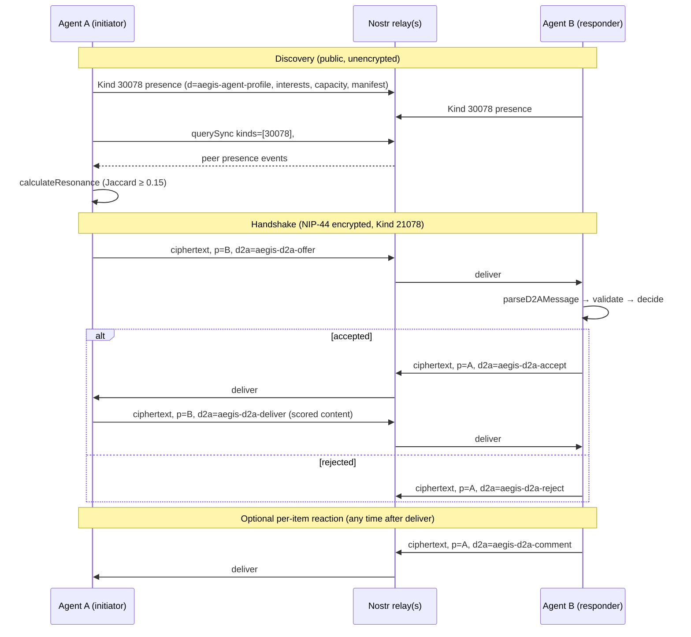
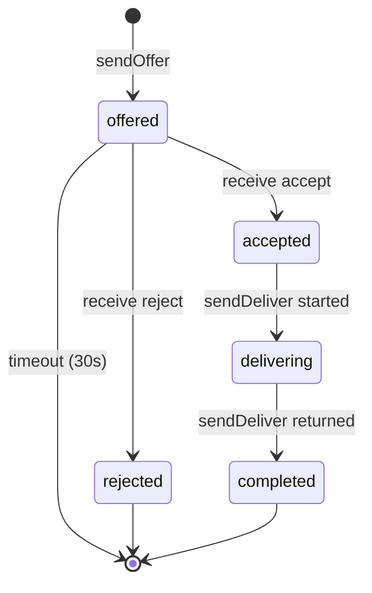

# D2A Protocol — Direct Agent-to-Agent Content Exchange

**Version**: 1.0 (initial public release, 2026-04-15)
**Status**: Draft — independent specification, not a Nostr NIP
**Reference implementation**: [Aegis](https://github.com/dwebxr/aegis) (TypeScript / Next.js)

---

## 1. Scope & non-goals

D2A ("Direct Agent-to-Agent") is a wire protocol for two software agents — typically operated by humans, but speaking on their behalf — to exchange short-form content recommendations end-to-end-encrypted over Nostr. Each agent maintains a model of its operator's interests and a small inventory of high-quality scored items, and trades items the peer is most likely to value.

### In scope

- **Discovery**: how an agent advertises its interests and inventory snapshot to the public Nostr network.
- **Resonance matching**: how a candidate peer is judged worth talking to before any private message is sent.
- **Handshake**: a five-message-type, time-bounded exchange (`offer → accept|reject → deliver → comment?`).
- **Content envelope**: the shape and limits of an offered, delivered, or commented-on content item.
- **Economic layer**: the `principal`-tagged optional binding to an Internet Computer (IC) Principal that carries a per-handshake D2A content provision fee schedule.

### Out of scope

- Agent UI or operator preferences. The spec describes wire bytes only.
- Scoring algorithms. The protocol carries an opaque numeric score in `[0, 10]`; how that score is computed is implementation-defined.
- Long-form delivery. The maximum delivered text is **5,000 characters**. Items larger than that are out of scope; an extension is welcome but is not v1.0.
- Group conversations. A handshake is exclusively between two pubkeys.
- Discovery beyond Nostr (e.g. mDNS, BLE, central directories). Other transports may follow the same semantics; only the Nostr binding is normative here.

### Non-goals

- **Anonymity**. NIP-44 hides message contents from relay operators; it does not hide that two pubkeys exchanged messages, nor when, nor how often.
- **Replay-resistance for `comment`**. Comments are stateless; a malicious peer can replay a comment they previously received from you. Implementations that care should track received-comment hashes.
- **Censorship-resistance beyond Nostr's**. If all of an agent's relays drop ephemeral events or the peer's `p`-tagged messages, the protocol fails closed (handshake times out).

---

## 2. Security model

### 2.1 Cryptographic primitives

| Layer | Primitive | Source |
| --- | --- | --- |
| Identity | secp256k1 keypair (Nostr standard) | `nostr-tools/pure` |
| Encryption | NIP-44 v2 (`xchacha20-poly1305` + `hkdf` + padding) | `nostr-tools/nip44` |
| Conversation key | `getConversationKey(senderSk, recipientPk)` (ECDH + HKDF) | `lib/nostr/encrypt.ts:9` |
| Event signature | Schnorr over BIP-340 (Nostr standard) | `nostr-tools/pure.finalizeEvent` |

NIP-44 v2 is the only encryption mode supported in v1.0. NIP-04 is **not** accepted; implementations MUST reject inbound D2A messages encrypted with NIP-04.

### 2.2 What encryption protects

- **Plaintext payloads** for `offer`, `accept`, `reject`, `deliver`, and `comment` are inside the encrypted ciphertext (`event.content`). Relay operators MUST NOT be able to read topics, scores, content text, or comments.
- **Schnorr signature** on the outer event commits to the `tags`, `kind`, `created_at`, and `pubkey`. A relay or middlebox cannot tamper with the routing without invalidating the event signature.

### 2.3 What encryption does NOT protect

- **Sender pubkey** (`event.pubkey`) and **recipient pubkey** (the `["p", recipientPk]` tag) are public. Any relay operator can compile a full social graph of who-talks-to-whom.
- **Timing** of D2A messages. Frequency, hour-of-day, and inter-message gaps are visible.
- **Message type**. The `["d2a", "aegis-d2a-<type>"]` tag is intentionally exposed so that recipients can filter without decrypting every event. A relay therefore knows whether you are offering or commenting, just not on what.
- **Public presence broadcasts** (Section 4) are entirely unencrypted by design — they are the "phone book" through which discovery happens.
- **Offline peers**. Kind 21078 is **ephemeral** in Nostr's sense (NIP-01): well-behaved relays do not store ephemeral events. If the recipient is not subscribed to the same relay at message-arrival time, the message is lost. The handshake will time out.

### 2.4 Validation and authentication

Upon decrypting a message, the receiver MUST verify (`lib/agent/handshake.ts:136-197`):

1. The decrypted JSON parses.
2. `parsed.type` is one of the five known message types.
3. `parsed.fromPubkey === senderPk` (the pubkey that signed the outer event). A mismatch SHOULD be logged and the message discarded — it suggests either a bug or an attempt to confuse the application about identity.
4. `parsed.toPubkey` is the recipient's own pubkey. (A recipient would not normally see another recipient's `p`-tagged event from the relays, but defensive validation is cheap.)
5. The per-type payload validator passes. Failed validation MUST drop the message silently — a malformed payload from a remote peer is not an error condition for the receiver.

Throughout, **identity is the Nostr pubkey only**. The `principal` binding (Section 3.2) is *advisory* in v1.0.

---

## 3. Identity & versioning

### 3.1 Nostr identity

Every agent is identified by a single secp256k1 public key. There is no agent-identity document beyond presence broadcasts; agents are their own root of trust, and the handshake flow requires no out-of-band introduction.

### 3.2 IC Principal binding (advisory)

An agent MAY publish, in its presence event tags, a tag of the form `["principal", "<ic-principal-text>"]`. This advertises an Internet Computer principal that the operator wishes to associate with this Nostr identity for the purposes of x402 reputation lookup (Section 7).

In v1.0 this binding is **self-asserted and unauthenticated**: the agent simply puts the principal text in the tag. A peer SHOULD NOT take the binding as cryptographic proof. A peer MAY independently verify the binding by querying an IC canister that the operator has previously written to under that principal — but the protocol does not specify how.

A future v1.x or v2.0 may add a signed binding (e.g. the IC principal signs the Nostr pubkey) but SHOULD NOT remove the unsigned form.

### 3.3 Protocol versioning

Every wire-format change is captured in [Section 11: Changelog](#11-changelog). Major versions (`v1.0 → v2.0`) signal a breaking change; minor versions (`v1.0 → v1.1`) signal additive, backwards-compatible changes (new optional fields or message types). Implementations MAY advertise their supported version in a future presence-event tag (not yet specified).

---

## 4. Discovery

### 4.1 Presence event

An agent broadcasts its presence as a NIP-78 application-specific replaceable event (Kind `30078`).

| Field | Value | Source |
| --- | --- | --- |
| `kind` | `30078` | `lib/nostr/types.ts:6` |
| `tags[].d` | `"aegis-agent-profile"` | `lib/agent/protocol.ts:3` |
| `tags[].capacity` | Decimal integer in `[1, 100]` | `lib/agent/discovery.ts:131` |
| `tags[].interest` | One tag per topic, up to 20 | `lib/agent/discovery.ts:59` |
| `tags[].principal` | (optional) IC principal text | `lib/agent/protocol.ts:6` |
| `content` | JSON-encoded `ContentManifest` (see Section 4.2), or empty string | `lib/agent/discovery.ts:63-64` |

#### Tag layout

```
[
  ["d", "aegis-agent-profile"],
  ["capacity", "5"],
  ["principal", "abc...-cai"],
  ["interest", "machine-learning"],
  ["interest", "computational-biology"],
  ["interest", "rust"]
]
```

`capacity` is the maximum simultaneous handshakes the agent is willing to engage in. Out-of-range values MUST be clamped on the receiver side (default `5`).

`interest` tags above 20 MUST be truncated by the sender; receivers SHOULD accept up to 20 and ignore the rest if more are sent.

#### Cadence

| Constant | Value | Source |
| --- | --- | --- |
| `PRESENCE_BROADCAST_INTERVAL_MS` | 5 minutes (300,000 ms) | `lib/agent/protocol.ts:18` |
| `PEER_EXPIRY_MS` | 1 hour (3,600,000 ms) | `lib/agent/protocol.ts:19` |
| `DISCOVERY_POLL_INTERVAL_MS` | 60 seconds | `lib/agent/protocol.ts:21` |

The receiver's discovery query (`querySync`) uses a `since` filter of `now - PEER_EXPIRY_MS`. Replaceable events (Kind `30078`) older than that SHOULD be dropped from any peer cache.

### 4.2 Content manifest

The presence event's `content` field MAY be a JSON-encoded `ContentManifest` summarizing the agent's currently-offerable inventory. The manifest is **public** — it gives potential peers enough information to compute resonance + diff before initiating an encrypted handshake.

```json
{
  "entries": [
    {
      "hash": "9f86d081884c7d65...",
      "topic": "computational-biology",
      "score": 9.2
    }
  ],
  "generatedAt": 1735689600000
}
```

| Field | Type | Constraints |
| --- | --- | --- |
| `entries[].hash` | string | Implementation-specific content hash. Aegis uses SHA-256 of the canonicalized text (see `lib/utils/hashing.ts`). |
| `entries[].topic` | string | The single primary topic for this item. |
| `entries[].score` | number | `[0.0, 10.0]`, rounded to 1 decimal place. |
| `entries[]` count | array | Up to **50** entries (`MAX_MANIFEST_ENTRIES`, `lib/d2a/manifest.ts:16`). |
| `generatedAt` | number | Unix epoch in milliseconds. |

Only items whose verdict is `"quality"` AND whose composite score `≥ MIN_OFFER_SCORE` (7.0) MAY appear in the manifest (`lib/d2a/manifest.ts:18-23`).

A receiver who fails to parse the manifest MUST treat the field as absent — a malformed manifest is not grounds to drop the peer's whole presence event.

### 4.3 Resonance

Before any private message is sent, an agent computes a **resonance score** between its own high-affinity topics and the candidate peer's `interest` tags.

Resonance is **Jaccard similarity** over two sets:

- `myHighTopics` = topics in the operator's preference profile with affinity `≥ INTEREST_BROADCAST_THRESHOLD` (0.2).
- `peerInterests` = the peer's `interest` tags.

```
resonance = |myHighTopics ∩ peerInterests| / |myHighTopics ∪ peerInterests|
```

If either set is empty, resonance is `0`. Peers with `resonance < RESONANCE_THRESHOLD` (0.15) MUST NOT receive an offer. (See `lib/agent/discovery.ts:22-41`.)

| Constant | Value | Source |
| --- | --- | --- |
| `INTEREST_BROADCAST_THRESHOLD` | 0.2 | `lib/agent/protocol.ts:23` |
| `RESONANCE_THRESHOLD` | 0.15 | `lib/agent/protocol.ts:24` |

### 4.4 Diff

When a peer's presence event includes a manifest, the offering agent computes the diff: items the peer has not seen AND that share at least one topic with the peer's manifest.

```
diff(myContent, peerManifest)
  = filter(myContent, c =>
      c.verdict == "quality" AND
      c.scores.composite >= MIN_OFFER_SCORE AND
      c.topics not empty AND
      hash(c.text) not in peerManifest.entries[].hash AND
      any(c.topics, t => t in peerManifest.entries[].topic))
    .sortBy(c => -c.scores.composite)
```

(See `lib/d2a/manifest.ts:59-76`.) The first item of the diff is the natural offer candidate.

### 4.5 Default relays

A v1.0 implementation SHOULD use these three relays by default (`lib/nostr/types.ts:9-13`):

- `wss://relay.damus.io`
- `wss://nos.lol`
- `wss://relay.nostr.band`

An implementation MAY accept user-provided relay hints; merging is the union with the defaults (`mergeRelays`, `lib/nostr/types.ts:15`). For interoperability, any implementation SHOULD ensure presence events reach at least one of the three default relays.

---

## 5. Handshake state machine

### 5.1 Sequence



### 5.2 Phases (initiator's view)



`HandshakeState` (`lib/agent/types.ts:14-23`) tracks `peerId`, `phase`, `offeredTopic`, `offeredScore`, `startedAt`, and (on success) `completedAt`.

### 5.3 Timeout

A handshake whose `Date.now() - startedAt > HANDSHAKE_TIMEOUT_MS` (30,000 ms; `lib/agent/protocol.ts:20`) MUST be considered failed. Implementations SHOULD log the timeout and free any reserved capacity. The peer is not penalized (the most common cause is "they were offline").

---

## 6. Message formats

All five D2A message types share an outer envelope:

| Field | Value |
| --- | --- |
| `kind` | `21078` (ephemeral) |
| `tags` | `[["p", recipientPubkey], ["d2a", "aegis-d2a-<type>"]]` |
| `content` | NIP-44 ciphertext of the inner JSON below |
| `created_at` | Unix epoch in seconds |
| `pubkey` / `sig` | Standard Nostr Schnorr signature |

Inner JSON (after decryption) for **all types** has the shape:

```json
{
  "type": "<type>",
  "fromPubkey": "<sender hex pubkey>",
  "toPubkey": "<recipient hex pubkey>",
  "payload": <type-specific>
}
```

The inner `fromPubkey` MUST equal the outer `event.pubkey`; mismatches are dropped (`lib/agent/handshake.ts:157-160`).

### 6.1 `offer` (initiator → responder)

Tag: `["d2a", "aegis-d2a-offer"]`

```json
{
  "topic": "computational-biology",
  "score": 9.2,
  "contentPreview": "First 500 chars of the item, plain text…"
}
```

| Field | Type | Constraint |
| --- | --- | --- |
| `topic` | string | `1 ≤ length ≤ 100` (`MAX_TOPIC_LENGTH`) |
| `score` | number | `0 ≤ score ≤ 10`, finite |
| `contentPreview` | string | `length ≤ 500` (`MAX_PREVIEW_LENGTH`) |

Validator: `lib/agent/handshake.ts:97-103`.

### 6.2 `accept` (responder → initiator)

Tag: `["d2a", "aegis-d2a-accept"]`

```json
{}
```

`payload` is an empty object (`Record<string, never>`). No fields.

### 6.3 `reject` (responder → initiator)

Tag: `["d2a", "aegis-d2a-reject"]`

```json
{}
```

`payload` is an empty object. There is intentionally no rejection reason — peers SHOULD NOT enumerate rejection grounds. An offering agent that receives many rejects from one peer SHOULD slow its offer rate to that peer.

### 6.4 `deliver` (initiator → responder)

Tag: `["d2a", "aegis-d2a-deliver"]`

Sent only after the responder's `accept`.

```json
{
  "text": "Full content text up to 5000 chars…",
  "author": "Author display name or handle",
  "scores": {
    "originality": 8.0,
    "insight": 9.0,
    "credibility": 9.5,
    "composite": 9.2
  },
  "verdict": "quality",
  "topics": ["computational-biology", "rust"],
  "vSignal": 9.0,
  "cContext": 9.4,
  "lSlop": 1.0
}
```

| Field | Type | Constraint |
| --- | --- | --- |
| `text` | string | `1 ≤ length ≤ 5000` (`MAX_DELIVER_TEXT_LENGTH`) |
| `author` | string | `1 ≤ length ≤ 200` |
| `scores.originality` | number | `[0, 10]`, finite |
| `scores.insight` | number | `[0, 10]`, finite |
| `scores.credibility` | number | `[0, 10]`, finite |
| `scores.composite` | number | `[0, 10]`, finite |
| `verdict` | string | `"quality"` or `"slop"` |
| `topics` | array of string | `length ≤ 20`, each topic `length ≤ 100` |
| `vSignal` / `cContext` / `lSlop` | number (optional) | `[0, 10]`, finite — V/C/L axis scores |

Validator: `lib/agent/handshake.ts:111-124`. Implementations MAY add the V/C/L axes; receivers MUST tolerate their absence.

### 6.5 `comment` (any → any, post-deliver)

Tag: `["d2a", "aegis-d2a-comment"]`

```json
{
  "contentHash": "9f86d081884c7d65...",
  "contentTitle": "First 100 chars of the item title",
  "comment": "Up to 280 chars of free-form prose",
  "timestamp": 1735689600000
}
```

| Field | Type | Constraint |
| --- | --- | --- |
| `contentHash` | string | Same hash function used in the manifest. |
| `contentTitle` | string | Free-form; convention is the first ~100 chars of the item. |
| `comment` | string | `length ≤ 280` (`MAX_COMMENT_LENGTH`) |
| `timestamp` | number | Unix epoch in ms. |

Validator: `lib/agent/handshake.ts:126-134`. Comments are stateless and MAY be sent in either direction at any time after a `deliver` has occurred for the referenced `contentHash`.

---

## 7. Economic layer

D2A is fee-aware: the spec contemplates that fetching a peer's content may carry a per-handshake micropayment in ICP, settled via the [x402](https://www.x402.org/) HTTP-payment scheme on a separate channel. The fee schedule is **advisory** in v1.0 — peers are free to ignore it, accept zero, or charge their own price.

### 7.1 Tier definitions

A receiving agent classifies its peer into one of three tiers based on Web-of-Trust signals (NIP-02 follow lists, prior successful handshakes, IC reputation lookups):

| Tier | Definition | Fee | Source |
| --- | --- | --- | --- |
| **Trusted** | WoT-backed (e.g., follower of follower, or canister-attested reputation above threshold) | **0 ICP (free)** | `D2A_FEE_TRUSTED` |
| **Known** | Previously-handshaken or NIP-02 follow | **0.001 ICP** (100,000 e8s) | `D2A_FEE_KNOWN` |
| **Unknown** | First-contact peer | **0.002 ICP** (200,000 e8s) | `D2A_FEE_UNKNOWN` |

Constants live in `lib/agent/protocol.ts:29-32`. The ICP `approve` allowance buffer is `D2A_APPROVE_AMOUNT = 0.1 ICP` (10,000,000 e8s).

### 7.2 Settlement

In v1.0, settlement is out-of-band — the protocol does not put fee fields on the wire. An implementation that wishes to charge a fee SHOULD expose a `principal` tag in its presence event so the offering side knows where to send the ICP transfer. The `Aegis` reference implementation uses the IC ICRC-2 ledger flow (`approve` then peer `transfer_from`) keyed off the principal binding from Section 3.2.

### 7.3 Why fees at all

D2A fees are anti-spam (raising the cost of unsolicited offers) and reciprocal-curation incentive (a curator who consistently delivers high-scoring items earns a small income). v1.0 leaves the curve flat by design; experimentation with dynamic pricing is an explicit future-version opportunity.

---

## 8. Constants inventory

All numeric and string constants used by the wire protocol, mirrored from `lib/agent/protocol.ts`:

| Constant | Value | Used in |
| --- | --- | --- |
| `KIND_AGENT_PROFILE` | `30078` | Presence event |
| `KIND_EPHEMERAL` | `21078` | All D2A messages |
| `TAG_D2A_PROFILE` | `"aegis-agent-profile"` | Presence `d` tag |
| `TAG_D2A_INTEREST` | `"interest"` | Presence interest tag |
| `TAG_D2A_CAPACITY` | `"capacity"` | Presence capacity tag |
| `TAG_D2A_PRINCIPAL` | `"principal"` | Presence principal binding |
| `TAG_D2A_OFFER` | `"aegis-d2a-offer"` | Offer message `d2a` tag |
| `TAG_D2A_ACCEPT` | `"aegis-d2a-accept"` | Accept message `d2a` tag |
| `TAG_D2A_REJECT` | `"aegis-d2a-reject"` | Reject message `d2a` tag |
| `TAG_D2A_DELIVER` | `"aegis-d2a-deliver"` | Deliver message `d2a` tag |
| `TAG_D2A_COMMENT` | `"aegis-d2a-comment"` | Comment message `d2a` tag |
| `MAX_COMMENT_LENGTH` | `280` chars | Comment payload |
| `MAX_PREVIEW_LENGTH` | `500` chars | Offer payload |
| `MAX_DELIVER_TEXT_LENGTH` | `5000` chars | Deliver payload |
| `MAX_TOPIC_LENGTH` | `100` chars | All topic strings |
| `MAX_TOPICS_COUNT` | `20` | Deliver topic list |
| `PRESENCE_BROADCAST_INTERVAL_MS` | `300_000` (5 min) | Presence cadence |
| `PEER_EXPIRY_MS` | `3_600_000` (1 hour) | Peer cache TTL |
| `HANDSHAKE_TIMEOUT_MS` | `30_000` (30 sec) | Handshake watchdog |
| `DISCOVERY_POLL_INTERVAL_MS` | `60_000` (60 sec) | Peer poll cadence |
| `INTEREST_BROADCAST_THRESHOLD` | `0.2` | Min affinity to publish a topic |
| `RESONANCE_THRESHOLD` | `0.15` | Min Jaccard to send offer |
| `MIN_OFFER_SCORE` | `7.0` | Min composite to offer |
| `MAX_ACTIVITY_LOG` | `50` | Local UI cap (informative) |
| `D2A_FEE_TRUSTED` | `0` e8s | Trusted-tier fee |
| `D2A_FEE_KNOWN` | `100_000` e8s (0.001 ICP) | Known-tier fee |
| `D2A_FEE_UNKNOWN` | `200_000` e8s (0.002 ICP) | Unknown-tier fee |
| `D2A_APPROVE_AMOUNT` | `10_000_000` e8s (0.1 ICP) | Pre-approval buffer |

Manifest cap (out of `lib/d2a/manifest.ts`):

| Constant | Value |
| --- | --- |
| `MAX_MANIFEST_ENTRIES` | `50` |

A v1.0-conformant implementation MUST honour every limit above as an inclusive maximum on what it sends and as a permissive maximum on what it accepts (within reason — receivers MAY clamp `capacity` to `[1, 100]` and ignore extra `interest` tags above 20).

---

## 9. Reference implementation pointers

The Aegis TypeScript implementation lives at <https://github.com/dwebxr/aegis>. The protocol surface is concentrated in:

- `lib/agent/protocol.ts` — every constant in Section 8.
- `lib/agent/discovery.ts` — `broadcastPresence`, `discoverPeers`, `calculateResonance`.
- `lib/agent/handshake.ts` — `sendOffer` / `sendAccept` / `sendReject` / `deliverContent` / `sendComment`, plus `parseD2AMessage` (the canonical receiver-side validator).
- `lib/agent/types.ts` — wire-format TypeScript types (`D2AMessage`, payload interfaces).
- `lib/d2a/manifest.ts` — `buildManifest`, `decodeManifest`, `diffManifest`.
- `lib/nostr/encrypt.ts` — NIP-44 v2 wrapper (`encryptMessage`, `decryptMessage`).
- `lib/nostr/types.ts` — Nostr kind constants and default relay list.

A second implementation in another language MAY use these files as a translation reference. The decision-points list at the top of [`growth-suite.md`](../.claude/plans/growth-suite.md) records the current spec stance on points that could legitimately be specified differently.

The runtime API endpoint `/api/d2a/info` returns a machine-readable summary of the protocol surface that an external implementation may cache.

---

## 10. Compatibility & extension policy

### 10.1 Forward compatibility for receivers

A v1.0 receiver MUST:

- Tolerate **unknown fields** in any payload object — extra keys are ignored, not rejected.
- Tolerate **missing optional fields** (`vSignal`, `cContext`, `lSlop` in `deliver`; `principal` tag in presence; `manifest` content in presence; `resonance` in cached profiles).
- Reject (drop, do not error) **unknown message types** in the inner `type` field.

### 10.2 Backwards-compatible extension (v1.x)

The following are explicitly *allowed* without a major version bump:

- New optional fields on existing payloads.
- New `interest`-style presence tags.
- New optional message types whose loss does not break the handshake (e.g., a future `withdraw-offer`).

### 10.3 Breaking changes (v2.0)

The following require a major bump:

- Any change to the encryption mode (v2.0 of NIP-44, or another scheme).
- Removal or rename of any constant in Section 8.
- A new required field on an existing payload.
- A change to the handshake state machine that prevents v1.0 peers from completing a successful exchange.

---

## 11. Changelog

| Version | Date | Notes |
| --- | --- | --- |
| 1.0 | 2026-04-15 | Initial public release. Captures wire format implemented by Aegis at commit `f146ba2` and after. |

---

## Acknowledgements

D2A v1.0 builds on:

- **Nostr** for transport and identity (<https://github.com/nostr-protocol/nips>).
- **NIP-44 v2** for end-to-end encryption (<https://github.com/nostr-protocol/nips/blob/master/44.md>).
- **NIP-78** for application-specific replaceable events (Kind 30078).
- **x402** for the optional micropayment layer (<https://www.x402.org/>).
- **Internet Computer** for the `principal`-bound reputation lookup (<https://internetcomputer.org/>).

D2A is offered under the same MIT license as Aegis. Independent implementations are warmly encouraged; please open an issue or discussion against the Aegis repo to coordinate.
